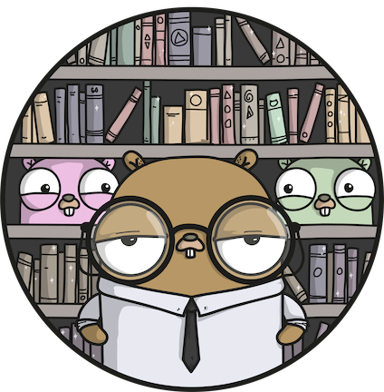

  

<h3 align="center">Goal Book</h3>

Learning Go from the book "The Go Programming Language"   (by Alan A. A. Donovan & Brian W. Kernighan)

    
    

---
# GOAL (Book version)

The GOAL of this project is to continue learning Go by doing the exercises of the book ["The Go Programming Language"](http://www.gopl.io/) (by Alan A. A. Donovan & Brian W. Kernighan).
[Book repository](https://github.com/adonovan/gopl.io/).

The repository is divided in chapters. Each one of them contains the examples from the book and the resolution of the exercises proposed by the book.

The book's examples are numbered. Each one of the folder that contains the example starts with a number that specifies the order in which the example appeared in the book.

### Chapter 1: Tutorial
It is a tutorial on the basic construct of Go, introduced through a dozen programs for everyday tasks like reading and writing files, formatting text, creating images, and communicating with Internet clients and servers.

- [Examples](./chapter1/examples)
- 

    <a href="./chapter1/exercises">Exercises</a>
    &nbsp;:arrow_right:&nbsp;
    

### Chapter 2: Program Structure
Describes the structural elements of a Go program: declarations, variables, new types, packages and files, and scope.

- [Examples](./chapter2/examples)
- [Exercises](./chapter2/exercises)

### Chapter 3: Basic Data Types
Discusses numbers, booleans, strings, and constants, and explains how to process Unicode.

- [Examples](./chapter3/examples)
- [Exercises](./chapter3/exercises)

### Chapter 4: Composite Types
Describes composite types, that is, types built up from simpler ones using arrays, maps, structs, and _slices_, Go's approach to dynamic lists.

- [Examples](./chapter4/examples)
- [Exercises](./chapter4/exercises)

### Chapter 5: Functions
Explains functions: recursion, multiple return values, errors, function values, anonymous functions, variadic functions, deferred function calls, panic and recover.

- [Examples](./chapter5/examples)
- [Exercises](./chapter5/exercises)

### Chapter 6: Methods
Explains methods: method declarations, methods with a pointer receiver, composing types by struct embedding, method values and expressions, an example of a 'bit vector type' and encapsulation

- [Examples](./chapter6/examples)
- [Exercises](./chapter6/exercises)

### Chapter 7: Interfaces
Describes: interfaces as contracts, interface types, interface satisfaction, parsing flags with `flag.Value`, interface values, sorting with `sort.Interface`, the `http.Handler` interface, the `error` interface, an example about 'expression evaluator', type assertions, discriminating errors with type assertions, querying behaviour with interface type assertion, type switches, an example of a 'Token-Based XML Decoding' and gives a few words of advice.

- [Examples](./chapter7/examples)
- [Exercises](./chapter7/exercises)

### Chapter 8: Goroutines and Channels
Talks about goroutines, channels, looping in parallel, multiplexing with a select and cancellation of the goroutines. It has many examples: 'Concurrent Clock Server', 'Concurrent Echo Server', 'Concurrent Web Crawler', 'Concurrent Directory Traversal' and a 'Chat Server'.

- [Examples](./chapter8/examples)
- [Exercises](./chapter8/exercises)

### Chapter 9: Concurrency with Shared Variables
Explains: race conditions, mutual exclusion using `sync.Mutex`, read/write mutexes using `sync.RWMutex`, memory synchronization, lazy initialization with `sync.Once`, the race detector, goroutines and threads, and gives an example of a 'Concurrent Non-Blocking Cache'.

- [Examples](./chapter9/examples)
- [Exercises](./chapter9/exercises)

### Chapter 10: Packages and the Go Tool
Introduces the concepts of: import paths, the package declaration, import declarations, blank imports, packages and naming and the Go tool.

- [Examples](./chapter10/examples)
- [Exercises](./chapter10/exercises)

### Chapter 11: Testing
Describes everything about testing: the `go test` tool, `Test` functions, coverage, `Benchmark` functions, profiling and `Example` functions.

- [Examples](./chapter11/examples)
- [Exercises](./chapter11/exercises)

### Chapter 12: Reflection
Talks about "Why reflection?" and describes: `reflect.Type` and `reflect.Value`, `Display` (a recursive value printer), setting variables with `reflect.Value`, accessing struct field tags, displaying methods of a type, and it gives a big caution message. It also has some examples: 'Encoding S-Expressions' and 'Decoding S-Expressions'.

- [Examples](./chapter12/examples)
- [Exercises](./chapter12/exercises)

### Chapter 13: Low-Level Programming
In this chapter the authors explore: `unsafe.Sizeof`, `Alignof` and `Offsetof`, `unsafe.Pointer`, Calling C Code with `cgo` and give a big warning about this whole topic. It also has an example: 'Deep Equivalence'.

- [Examples](./chapter13/examples)
- [Exercises](./chapter13/exercises)

---
## License

To satisfy the license from the book's [repository](https://github.com/adonovan/gopl.io), this repository is also licensed under a [Creative Commons Attribution-NonCommercial-ShareAlike 4.0 International License](https://creativecommons.org/licenses/by-nc-sa/4.0/)