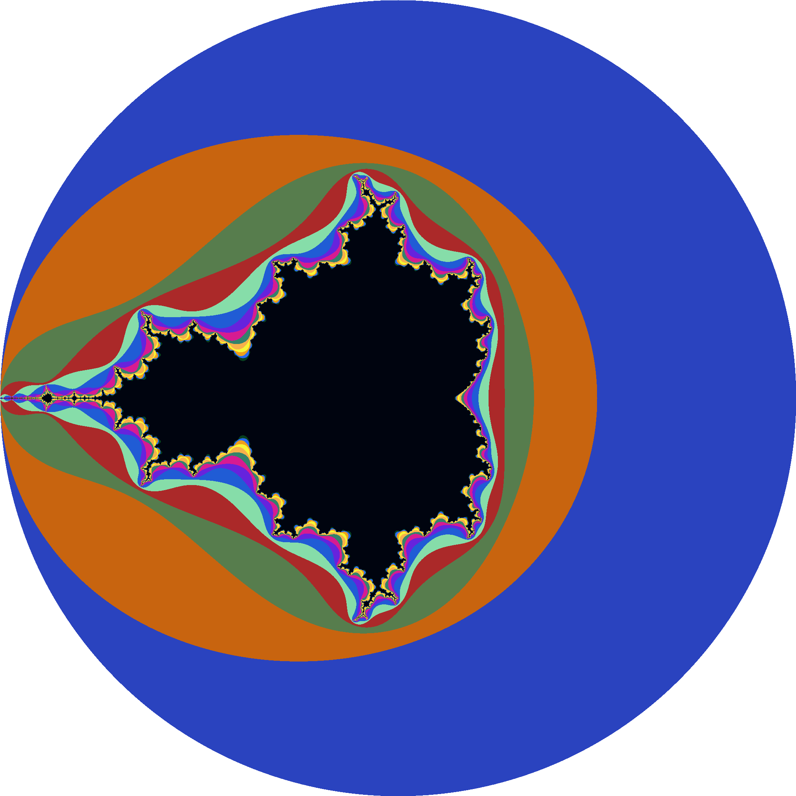
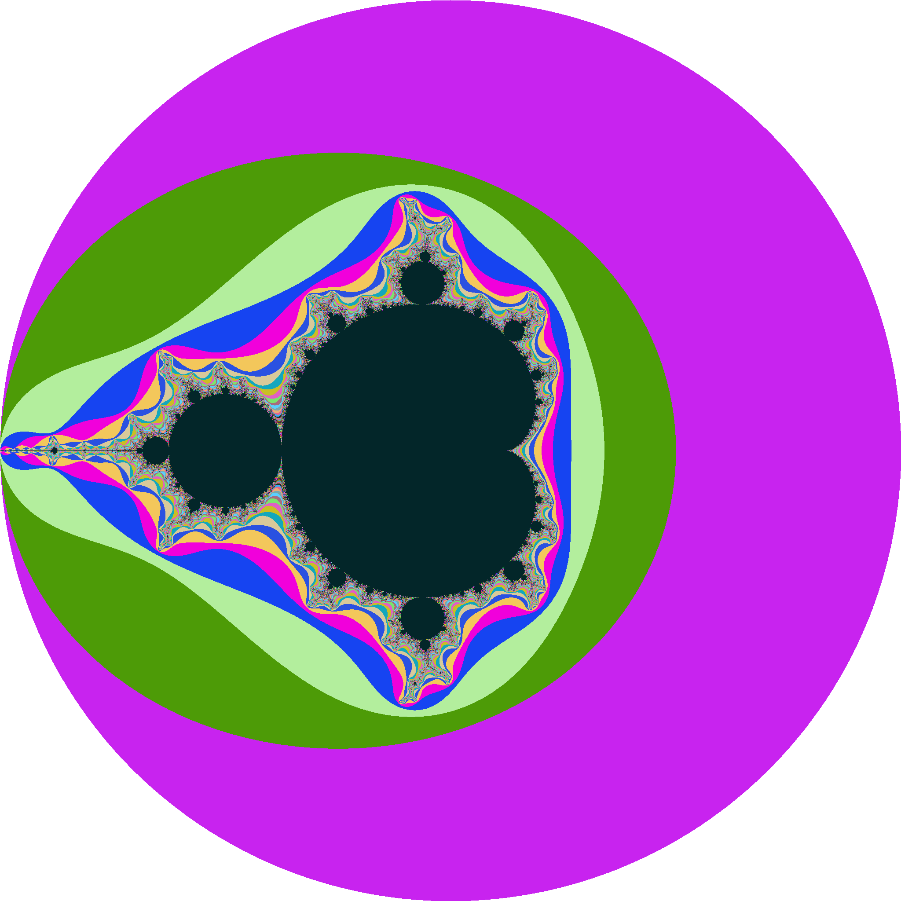

## Exercise 5 attempts

I've tried 2 different approaches. The first one using a palette of 16 colors, and the second one using a base palette of 16 colors and interpolating the rest of the colors based on the number of iterations specified by the `maxIterations` constant.

Here are the results:

### First Approach

Using a basic palette of 16 colors. Notice that there are parts where the red is over some other parts that should be painted in any other color based on its iteration number.

### Second Approach

A better example of a well-defined Mandelbrot Set. With more colors is easier to identify the black parts and the colored ones.
